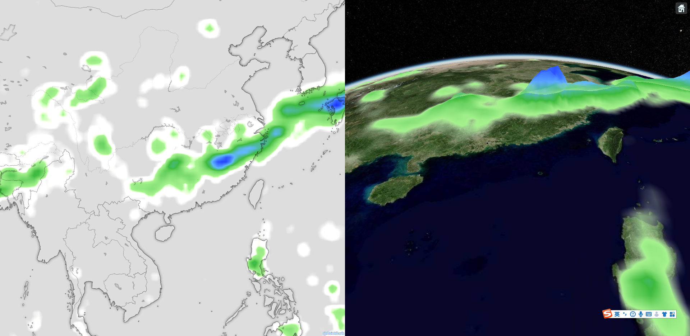
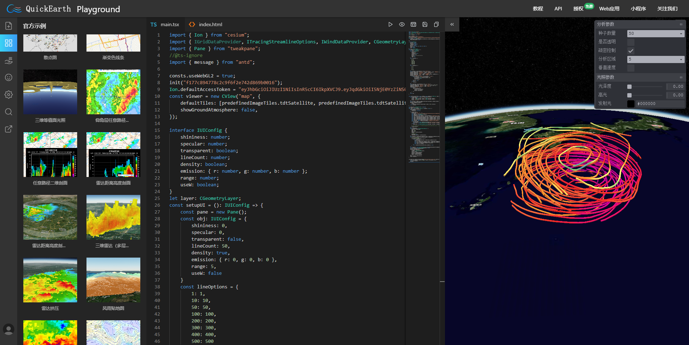

### 基本使用

- 从npm安装QuickEarth包和ts的d文件

```bash
npm install @quickearth/core@latest
npm install @quickearth/leaflet@latest
// 如果需要使用三维
npm install @quickearth/cesium@latest
```

- 下载附加资源包

可以从本仓库的public目录中下载，下载后放置到项目的静态资源目录（含public目录本身），如果想放到其他目录，有以下内容需要在代码中指定：

```js
consts.resourcePath="public"
consts.defaultLegendPath="public/styles/colors"
consts.wasmPath="public/libs/wasm"
consts.workerPath="public/libs/workers"
```

- 开始编码 （参见代码index.ts）
  
> 注意，如果使用二维，需要代码中```import "leaflet/dist/leaflet.css"```

> 如果使用三维，需要在index.html中引入以下内容（请使用public下的cesium版本，以便更好的支持webgl2）：

```html
<link rel="stylesheet" href="public/libs/cesium/Cesium/Widgets/widgets.css" />
<!--发布版换成非Unminified版本-->
<script src="public/libs/cesium/CesiumUnminified/Cesium.js"></script>
```

### 本脚手架自带一个DEMO，效果如下



### 更多在线交互测试



[http://qecloud.91weather.com/](http://qecloud.91weather.com/)