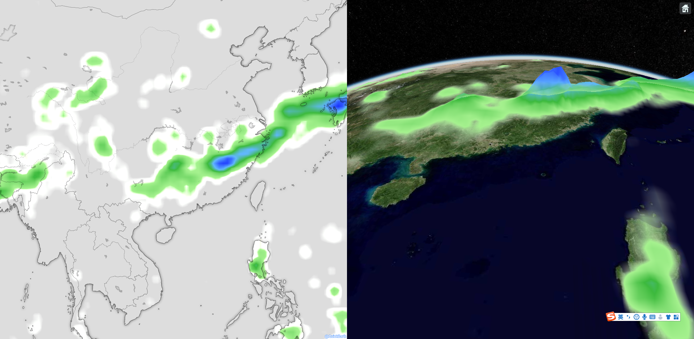
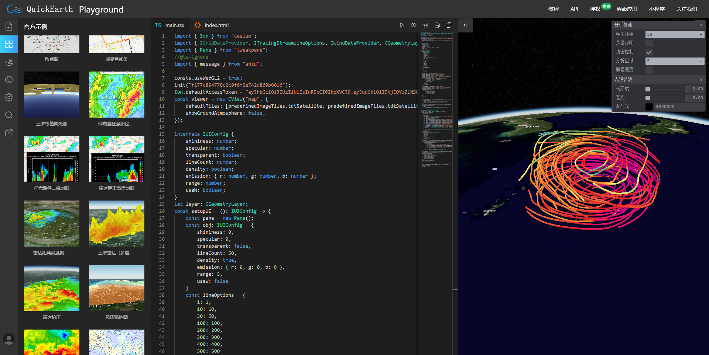

> Webpack版本的starter项目见：[https://github.com/quickearth/quickearth-webpack-starter](https://github.com/quickearth/quickearth-webpack-starter)。

### 使用脚手架

- 项目下载到本地
- ```npm install```安装依赖后即可使用


### 自行安装使用

- 从npm安装QuickEarth包和ts的d文件

> 注意，最低请使用3.0.5的版本。如果Cesium使用从index中的script标签进行导入（如示例中），那么请确保webpack的打包方式为umd，否则会出现获取不到cesium实例的情况。

```bash
npm install @quickearth/core@latest
npm install @quickearth/leaflet@latest
// 如果需要使用三维
npm install @quickearth/cesium@latest
```

- 下载附加资源包（使用demo脚手架则无需额外配置）

可以从本仓库的public目录中下载，下载后放置到项目的静态资源目录（含public目录本身），如果想放到其他目录，有以下内容需要在代码中指定：

```js
consts.resourcePath="public"
consts.defaultLegendPath="public/styles/colors"
consts.wasmPath="public/libs/wasm"
consts.workerPath="public/libs/workers"
```

- 开始编码 （参见代码index.ts）
  
> 注意，如果使用二维，需要代码中```import "leaflet/dist/leaflet.css"```

> 如果使用三维，需要在index.html中引入以下内容（请使用public下的cesium版本，以便更好的支持webgl2），当然也可以按照cesium官方配置，使用其他模块化方式进行导入，QE输出是umd包，都是支持的：

```html
<link rel="stylesheet" href="public/libs/cesium/Cesium/Widgets/widgets.css" />
<!--发布版换成非Unminified版本-->
<script src="public/libs/cesium/CesiumUnminified/Cesium.js"></script>
```

> 如果使用三维的时候使用Typescript，那么还需要配置cesium的描述文件，可以在tsconfig.json中的compilerOptions中增加如下配置：

```json
"paths": {
    "cesium*": [
        "./public/libs/cesium/Cesium/Cesium.d.ts"
    ]
}
```

- 打包发布
  
执行```npm run build```，然后将根目录的public拷贝到dist目录一起发布即可。

### 本脚手架自带一个DEMO，效果如下



### 更多在线交互测试



[http://qecloud.91weather.com/](http://qecloud.91weather.com/)